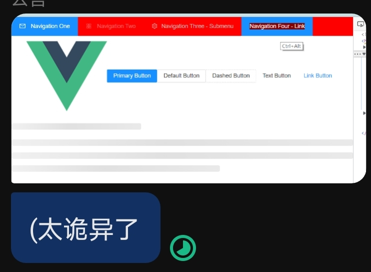

嗯...就是说，学点css。

就说是，一开始的时候，css对我就只是改个元素大小颜色的小东西，没想过有其他的用处...\
但是看了好多之后，css也好nb哦...现在的css..动画、布局、响应式啥的都整出来了。\
不是说好了all in js的吗...为什么好多骚操作还是放到了html和css里面...嘤嘤嘤

而另一方面，如果要工程化，css写起来还是很操蛋。\
大概是出现了三条路

- 第一个是为了快速开发就出现了boostrap这样的组件库，被称为“组件化”。而针对热门的前端框架还有element-ui，antd等等，这些组件甚至不光是UI，连一部分逻辑都封进去了。缺点是什么？缺点就是没法自己定制，除非这些组件库本身开几个接口让定制，否则难以修改，下面有一个我在好久之前我尝试自己修改时的鬼畜效果。

- 第二个是css预处理器，sass，less这种的，写的还是css，但是优化很多。
- 第三个...大概是从postCss衍生出的tailwind、unocss这些叫做“原子化”的一种，感觉有点怪...它们将css的style的重做了一遍放在class里写，确实是不用写css了，新给出的class可能也的确清晰了些，但这些复杂度又重新转到了html文件里而且不像css还能拆出来。没咋用过。~~看起来有点憨。~~
