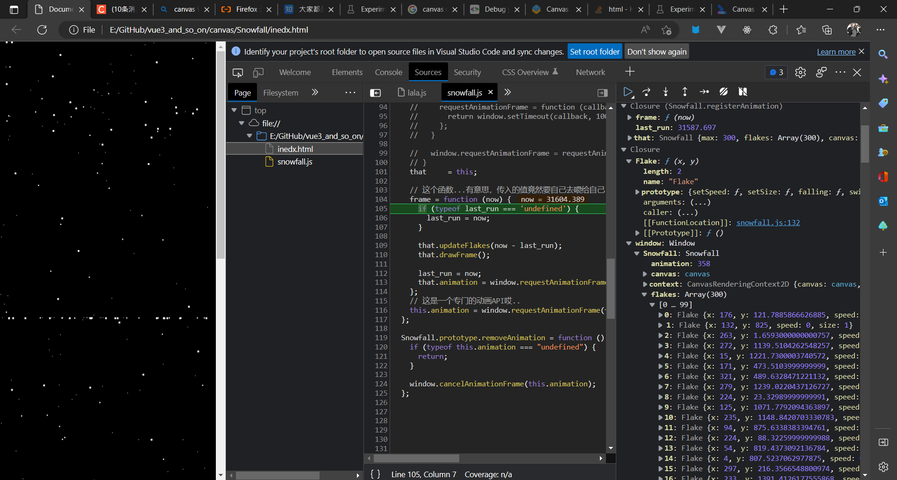

嗯...其实，也是，找到的几个仓库。然后，看代码。

找到的感觉写的最清楚的是这一个，我还跟着去看了点原型相关的东西。
**[Gargron/Snowfall](https://github.com/Gargron/Snowfall)**

另外提一下...这个作者竟然也是 mastodon 的主要开发者...好厉害...世界好小...

### 调试工具

但是...感觉能看懂，但是我尝试删改东西的时候就是不起效果，也不知道哪出的问题...
去找了半天canvas debugger工具，然后，发现tmd有一堆搬的十年前的文章...原文是这个[https://web.dev/canvas-inspection/]

[https://stackoverflow.com/questions/9143209/html5-canvas-inspector]
也看到有一些近几年的提问...就这个，但我按照这个找不到canvas的选项...

然后放弃了...

但，如果canvas做的就只是像素操作，那debug可能也看不到什么东西。说是偏底层的操作省性能...但就算提供了简单的接口让用但调试也是问题啊...其实我也看到一个直接用html的div做这个特效的，几年前的一个仓库到现在我用现在的机器去调式都卡卡的...

再者，其实只要看数据就可以了，有像针对html dom那样快速查看元素的当然好...但没有的话，能找到地方看数据也可以。再一个...对于这种超频繁刷新的玩意...别用console log，console log在大量调用的时候也很耗费性能，没几秒就上万次调用直接把我电脑整的卡的不得了......所以...这边有专门的工具，可以暂停，能看变量值和函数栈之类的东西。



### 动画

我以为主要精力会放在canvas画图上...但没想到在动画上画的功夫更多...
说起动画，就是，快速变化的相互差异较小或者说连续一张张图像，造成错觉。
两个点，一个是变化的图像或者说状态，一个是把它们连在一起。
然而，怎么连在一起？那就是————回调函数。

html5 给了一个专门的用于动画的API，用于接收一个个关键帧并调用回调函数。然而如果不用这个的话，虽然听起来有点奇怪甚至离谱...但setTimeout也能用来做动画......

[https://developer.mozilla.org/zh-CN/docs/Web/API/Window/requestAnimationFrame]

对于上面那个仓库，具体代码如下，now - last_run算出时间差，这个就是一个时间轴一样的东西...被updateFlakes()用于计算下一帧图像

```js
    frame = function (now) {
      if (typeof last_run === 'undefined') {
        last_run = now;
      }

      that.updateFlakes(now - last_run);
      that.drawFrame();

      last_run = now;
      that.animation = window.requestAnimationFrame(frame);
    };
    // 这是一个专门的动画API哎..
    this.animation = window.requestAnimationFrame(frame);
```

也许会有更复杂的函数来模拟各种运动，但是对于这个小脚本而言，简单的时间乘速度就可以了。

### 小脚本好漂亮

这个小脚本...虽然只有一百多行...但写的好漂亮...

将飘雪这个小特效分成了两个方面， Snowfall 和 Flake/Flakes。

Snowfall 是类似背景，舞台的一个对象，而 Flake/Flakes 则是具体的会飘下来的一个个小雪花。 Snowfall 提供了 canvas 画布，加了个eventListener ，然后就开始调用 Flake/Flakes 身上的属性和方法(主要是拿到位置和速度(速度这个也可以说是运动、改变位置的方式))获得一帧帧画面自己再去找回调函数把这些画面连起来。

这个抽象范式感觉可以有好多用法..比如做重力，会相互吸引的小东西的场景，碰撞......

#### 我想加东西但是不起作用呜呜呜

想加的主要有两个，一个是左右摇摆的一个随机运动还有风向，还有一个就是和html的dom元素交互，比如在特定的小dom上落雪这样...

前一个我以为在学着作者在 Flake 上加个方法，像

```js
Flake.prototype.swing = function (delta) {
    this.x += delta * this.speed; 
}
```

这样就可以...但是tmd就是不起作用或者特别鬼畜！
...
至于和其他dom元素交互，我想到的办法是，获取 html 中 dom 的left top height width 也就是位置和大小，然后用这些数据在 canvas 图层去绘制相应的图形，也不是显式的绘制，但是得标记一下，然后让雪花和 canvas 图层里标记出来的这个东西交互。但是...还有很多问题，比如雪花积累太多怎么办，要不要再给每个雪花加个 token 用来管理时间过长...这个应该也没那么难搞，像上面 now - created_token < lifeTime 就行，再一个就是，雪花和雪花之间要不要做碰撞堆叠的交互？

md想想就难搞，不会啊啊啊啊啊。看了这么多啥都没弄出来...
感觉我就像是在商场瞎逛但是其实一分钱没有就只能看看这种的...太菜了啊啊啊啊啊..不过我根本不会去逛商场..可能看看也总比不动弹强吧..

### 插入博客

哇...竟然可以直接用标签插入脚本的吗，好方便..嘿嘿...为了方便看效果，我把这个页面的亮色模式也改成暗色了。

[https://v2.vuepress.vuejs.org/zh/advanced/cookbook/markdown-and-vue-sfc.html]

其实有想用一用自定义插件的...
[https://vuepress.vuejs.org/zh/guide/using-vue.html]
但现在还没必要。

<style>
html body {
  color :white;
  background : black;
}
</style>

<script>

  (function (window) {
  'use strict';
  var Flake, Snowfall;

  Snowfall = function (max) {
    if (typeof max === "undefined") {
      max = 300;
    }

    if (!window.HTMLCanvasElement) {
      console.warn('Snowfall.js is aborting due to the browser not supporting <canvas>');
      return;
    }

    this.max    = max;
    this.flakes = [];

    this.createCanvas();
    this.generateFlakes();
    this.registerAnimation();
    this.bindDOMEvents();
  };

  Snowfall.prototype.createCanvas = function () {
    this.canvas = document.createElement('canvas');
    this.canvas.width  = window.innerWidth-30;
    this.canvas.height = window.document.body.clientHeight
    this.context = this.canvas.getContext('2d');

    this.canvas.setAttribute('style', 'position: absolute; top: 0; left: 0; z-index: 99999; pointer-events: none');
    document.body.appendChild(this.canvas);
  };

  Snowfall.prototype.bindDOMEvents = function () {
    var throttle, that;

    that = this;

    window.addEventListener('resize', function () {
      if (typeof throttle === "undefined") {
        throttle = window.setTimeout(function () {
          throttle = undefined;
          that.canvas.width  = window.innerWidth-30;
          that.canvas.height = window.document.body.clientHeight
        }, 100);
      }
    }, false);
  };

  Snowfall.prototype.generateFlakes = function () {
    var i;

    for (i = 0; i < this.max; i += 1) {
      this.flakes.push(new Flake(Math.floor(Math.random() * this.canvas.width), Math.floor(Math.random() * this.canvas.height)));
    }
  };
  // 这个delta是时间差...
  Snowfall.prototype.updateFlakes = function (delta) {
    var i, len;

    for (i = 0, len = this.flakes.length; i < len; i += 1) {
      this.flakes[i].falling(delta);
      // this.flakes[1].swing(delta);
      // this.flakes[1].landed()

      if (!this.flakes[i].isVisible(this.canvas.width, this.canvas.height)) {
        this.flakes[i].reset(Math.floor(Math.random() * this.canvas.width), 0);
      }
    }
  };

  Snowfall.prototype.drawFrame = function () {
    var i, len, flake;

    this.context.clearRect(0, 0, this.canvas.width, this.canvas.height);
    this.context.fillStyle = '#fff';

    for (i = 0, len = this.flakes.length; i < len; i += 1) {
      flake = this.flakes[i];
      this.context.fillRect(flake.x, flake.y, flake.size, flake.size);
    }
  };

  Snowfall.prototype.registerAnimation = function () {
    var last_run, frame, that;

    // if (typeof window.requestAnimationFrame === "undefined") {
    //   var requestAnimationFrame = window.mozRequestAnimationFrame || window.webkitRequestAnimationFrame || window.msRequestAnimationFrame;

    //   if (typeof requestAnimationFrame === "undefined") {
    //     console.warn("Snowfall.js is falling back to 100ms animation intervals");

    //     requestAnimationFrame = function (callback) {
    //       return window.setTimeout(callback, 100);
    //     };
    //   }

    //   window.requestAnimationFrame = requestAnimationFrame;
    // }
    that     = this;

    // 这个函数...有意思，传入的值竟然要自己去喂给自己...好吧就是递归，但是这个递归不会返回，会一直咬自己。
    frame = function (now) {
      if (typeof last_run === 'undefined') {
        last_run = now;
      }

      that.updateFlakes(now - last_run);
      that.drawFrame();

      last_run = now;
      that.animation = window.requestAnimationFrame(frame);
    };
    // 这是一个专门的动画API哎..
    this.animation = window.requestAnimationFrame(frame);
  };

  Snowfall.prototype.removeAnimation = function () {
    if (typeof this.animation === "undefined") {
      return;
    }

    window.cancelAnimationFrame(this.animation);
  };


  Flake = function (x, y) {
    this.reset(x, y);
  };

  Flake.prototype.setSpeed = function () {
    // 60% 都被设为0.1...而更快的在之后0.1到0.5之间跳...
    this.speed = Math.max(0.1, Math.random() * 0.5);
  };

  Flake.prototype.setSize = function () {
    this.size = Math.max(1, Math.floor(Math.random() * 4));
  };

  Flake.prototype.falling = function (delta) {
    this.y += delta * this.speed;
  };

  Flake.prototype.swing = function (delta) {
    this.x += delta * this.speed;
  }

  Flake.prototype.landed = function () {
    this.speed = 0
  }

  Flake.prototype.melt = function() {
    this.melt = false
  }
  
  Flake.prototype.isVisible = function (bx, by) {
    return (this.x > 0 && this.y > 0 && this.x < bx && this.y < by );
  };

  Flake.prototype.reset = function (x, y) {
    this.x = x;
    this.y = y;
    this.setSpeed();
    this.setSize();
  };

  window.Snowfall = new Snowfall(300);
} (window));
</script>
