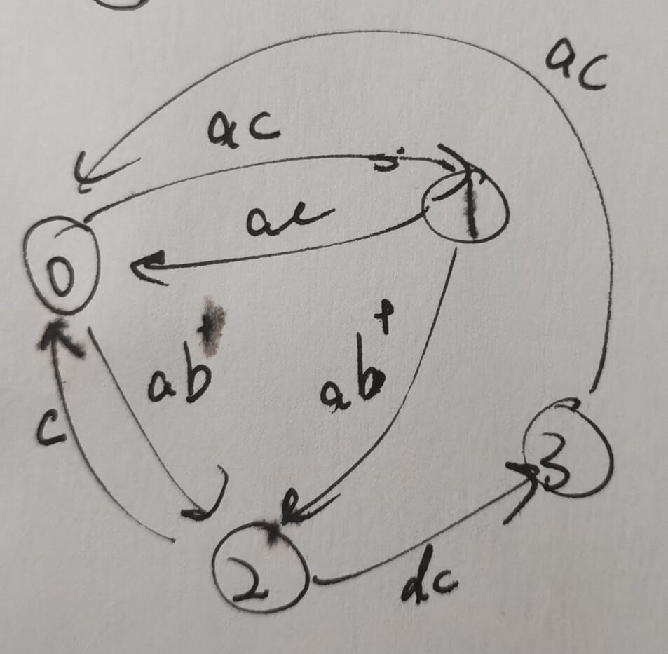

状态——这是个很棒的概念，因为这个概念什么都不是，所以你几乎可以把任何东西填进去，把这里作为一个知识库各种玩意的一个中继点。~~就像 js 原型链最头头上是个 null。~~  

<details>
<summary>

> “状态”
</summary>

>>相比 Expressions，Statements 远没有那么天经地义，还有很多名词都能让我想到这个东西...状态机，寄存器，记忆，temp，channel...嗯。经典的定义与赋值就属于Statements。编程里的单等号不是数学表示相等的等号而是“赋值”。
>---
>>我又在react文档看到了这部分... useState 弄出的东西被叫做组件的记忆，而为了代码的健壮，通常，我们要谨慎的设计、控制、最小化这一部分。
>---
>>状态机。程序，计算机提供的所以服务都能被看作是，状态机。  
从编程角度来讲，在以 C 语言为代表的高级语言的控制流出现之前，在编程还是直接在内存里到处 jump 的年代，就已经有状态这个概念了，在那时也确实会需要流程图这种玩意——全是 goto，不画个图代码可能是真的没法看，而这里画的这个图，就可以看做一种状态机(代码如果看得懂的话也是)。
>---
>>一个人能能走的多远不在于他在顺境时能走的多快，而在于他在逆境时多久能找到曾经的自己。——KMP/动态规划。
>---
>>前端的一些“状态管理”的库或者说方案，还有那个有名的RxJS... Promise, 甚至上升到一些编程范式设计模式，比如各种“生命周期”...
>---
>>编译原理中的一些。
>---
>>甚至在狭义的编程之外，一些素材比如图像处理之类的，会用各种线把各种模块连在一起搞出一个...流水线一样东西。

</details>

状态这个东西...在上面都有体现。但是今天我想做的是，尝试讨论、展示一下它在前端，不，更狭义些，UI 方面的一些作用。~~因为好玩，顺便提一下动作游戏里的好多好多，从各种运动，到各种酷酷的技能 konami 都可以用状态来理解~~


### 1. isActive  
在 UI 中体现的最简单常见的状态也许是随处可见的鼠标悬浮时的高亮，一个按钮/菜单点击后会在激活与非激活或者黑白主题间切换...... 它们很简单，它们是简单的 true or false。一个变量甚至不需要用变量就可以解决。  
用控制流，可以写出一个简单，但又十分经典的  

``` js
let isActive = false
function toggleActive() {
  if (isActive)  isActive = false
  else isActive = true
}

// or
function toggleActive() {
  isActive = !isActive
}

// and another or
function toggleActive() {
  if(hover) isActive = true // 而 hover 这个事件... 是另一个，也许需要时刻计算的事件。
  else isActive = false
}
```

### 2. dialog bubble  
这里我想关注的是一个聊天软件里的 ui 的细节，一组消息的气泡如果是一个人连续发出的，那么首尾的气泡样式会不一样，而这一组也只会显示一次头像。  
能想象的到的是，从后端返回的数据可能并不会一组一组来，因为即时性的消息是一条一条发的... 这个分组在前端去做是很合理的，在后端处理... 没必要。  

``` js
let prev = '' // 这就是一个用于记录状态的变量，下面会比较收到的这一条消息和上一条那条消息是否是同一用户发出，如果是，则不创建新的组，直接在之前的那一组继续添加，如果不是，则会新建一个组。
function addMessage(message) {
  if (message.user === prev) {
    // add to prev's wrapper directly
  } else {
    // create new wrapper and add to it

    prev = message.user  // update prev
  }
}
```

然后配合着 css 的 first | last-child 选择器就可以给每一组的首位元素单独添加样式lo。

### 3. floating action button  
它的灵感有两个，一个是了解到的 fab 本身，另一个是... 小时候玩的桌面宠物。  
我希望的是，能够被拖动，能够被点击，它能够在屏幕上自由的移动，有展开和收起的动画，被拖到边缘时，会有一个停靠。

- 它的*状态*会多一些，相互转换的*方法*也不止有一个，先列出来并标上数字字母
  - 状态有从UI角度看有下面这样四个显像的状态，~~其实另外一些相对而言比较不可名状的中间态 status，选下面四个，也只是其中一种视角~~
    - default - 0
    - active - 1
    - dragging - 2
    - sticky  - 3
  - 方法主要是鼠标/触摸的事件的三段，加上一个边界检测
    - start - a
    - move  - b
    - end  - c
    - collision - d

- 代码我写的稀碎(而且移动端会没法用，还有好多不知道怎么修的东西...)。我会想画一个图来表示这个玩意。  
  [*floating-action-button*](https://huamurui.github.io/html-s/floating-action-button.html)  —— right click to see the source code.

  
  好吧我图画的也很烂，但是我觉得这个图还是能够表达我的意思的。纯粹以图的形式来看，它并不是最简的，但...我会觉得它容易看。

### 4. slider  
其实是我翻 swiper.js 代码的时候看到的一些... 原来一个小小的幻灯片也可以有生命周期这种抽象...  
slider 的许多炫酷特效，都会将片子分成 cur, prev, next 还有啥都不是的四大类，然后在切换时，会有一些动画，这些动画有位置、缩放、叠压优先级、透明度...... 加上如何处理拖拽、点击、滚动、键盘事件...

还没写，所以

work in progress...

### 5. action game | platformer

~~这才是我写这玩意的目的~~

5.1.1 move  
想想那些 ↑↓←→ 控制角色移动的时候... 按键会有一个开始加速，结束减速，与中间的持续过程。有了前后的缓冲，动静的转换是平缓的。这些我们可以直接通过弄一个摩擦力，以此来模拟运动。再或，不要在这里搞摩擦力，定一个 max_speed acc desc，然后使用更直接的状态去标识，这样做，不光调整整个过程的“运动曲线”调整手感会更方便，添加新的运动形式，“技能”等等，也可以接着，同样，通过摞状态来完成。  
5.1.2 collision  
这里是一些基础的物理效果。碰撞，重力，阻力...

5.2.1 jump  
第二个是，跳跃或猛冲这种，什么时候能跳，什么时候可以扒墙...，以及跳跃的速度，空中的操作...  
5.2.2 climb  
抓墙  
5.2.3 dash  
冲刺冷却与方向。震屏。

~~5.2.4 ultra dash~~

下面是一些更具体 emmm 或者说更细节的东西。游戏操作的宽容度。  
some trikes for improving the game experience:

5.3.1. Variable Jump Height  
5.3.2. Apex Modifiers  
5.3.3 Jump Buffering  
5.3.4 Coyote Time  
5.3.5. Clamped Falling Speed  
5.3.6. Wall Sliding  
5.3.7. Wall Jumping  

<details>
  <summary>为什么是前端...</summary>

  写页面的时候，莫名想起来小小时候被老师安排去弄手抄报黑板报。老是挑我可能是因为开始的一两次在画画这方面表现出了些东西，然后再朝前就是小小小小小时候妈妈带着我画画的时候...  
  被安排弄手抄报的时候，一开始还挺新鲜，到后面就是...觉得烦人——为什么非要我去弄，占我的课间课后，还什么回报都没有，丢我包辣条都好啊...我脑子里全是趁课间把作业糊完然后回家好好玩...  

  另一个就是，大学跟着学校上课上了那么久我都几乎没怎么写代码，也更没写出过什么像样的东西出来；说远些... 上了这么多年的学，学的那些东西除了在卷子上发挥过用处，...更多的都，你知道吗，我现在觉得我简直就是在糟蹋那些知识还有我的脑子。也许它们在某些时候某些地方起着作用。但在我这里...  
  所以年初的那段时间我会对做一个小动画，一个小球的物理模型有执着，里面用到的东西不多，只是中学的数学物理的一些简单的小玩意...，就，天呐，告诉我，它们还是有点用的对吧，哪怕只是看个乐，取悦一下自己。

  而写页面和写代码，嗯... 我小时候并没有接触过编程，一开始时相比那些代码，更容易让我感觉到些东西的就是屏幕上的视觉效果。但另一面我也确实看了些对我来说有些云里雾里的编程指南，所以，我会想找一些与 UI 强相关的逻辑，来说一说。  
  ~~游戏客户端应该也算前端，是吧~~
</details>
